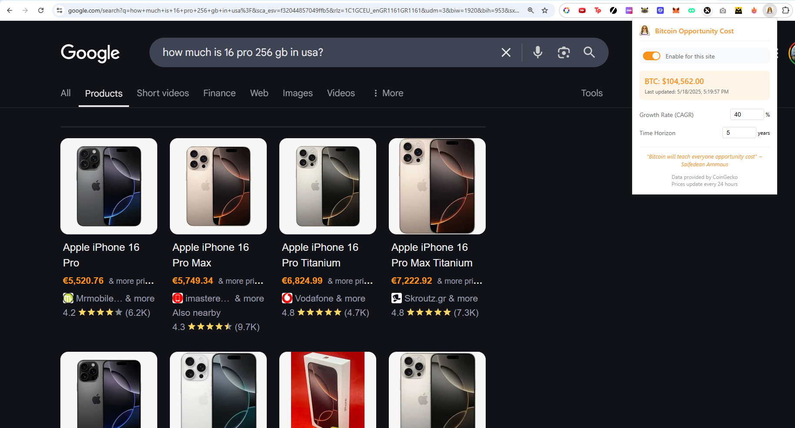

# Bitcoin Opportunity Cost Chrome Extension

This Chrome extension shows the opportunity cost of purchases in terms of potential Bitcoin value. When you browse websites, it automatically detects prices and shows what they could be worth in the future if that money was invested in Bitcoin instead.



## Features

- 🔍 Automatically detects prices in multiple currencies
- 📈 Shows potential future value based on Bitcoin's historical growth
- ⚡ Efficient performance with lazy loading and batch processing
- 🌐 Supports multiple currencies (USD, EUR, GBP, JPY, etc.)
- ⚙️ Customizable growth rate and time horizon
- 🔄 Daily Bitcoin price updates via CoinGecko API

## Installation Instructions

Since this extension is not yet published on the Chrome Web Store, you'll need to install it in Developer Mode. Here's how:

1. **Download the Extension**
   ```bash
   # Clone the repository
   git clone https://github.com/glowleaf/opportunitycost.git
   # Or download and extract the ZIP file from GitHub
   ```

2. **Open Chrome Extensions Page**
   - Open Google Chrome
   - Type `chrome://extensions/` in the address bar
   - Or go to Menu (⋮) > More Tools > Extensions

3. **Enable Developer Mode**
   - Look for the "Developer mode" toggle in the top-right corner
   - Turn it ON

4. **Load the Extension**
   - Click "Load unpacked" button in the top-left
   - Navigate to the folder where you downloaded/cloned the extension
   - Select the folder and click "Open"

5. **Verify Installation**
   - You should see the Bitcoin Opportunity Cost extension in your extensions list
   - The extension icon should appear in your Chrome toolbar

## Usage

1. **Enable/Disable**
   - Click the extension icon in the toolbar
   - Use the toggle switch to enable/disable for the current site

2. **Customize Settings**
   - Click the extension icon
   - Adjust the Growth Rate (CAGR) percentage
   - Set your preferred Time Horizon in years

3. **View Opportunity Costs**
   - Browse any website with prices
   - Hover over the converted prices to see details
   - The tooltip shows current price, BTC equivalent, and potential future value

## Development

To modify or contribute to the extension:

1. **Setup**
   ```bash
   git clone https://github.com/glowleaf/opportunitycost.git
   cd opportunitycost
   ```

2. **Make Changes**
   - Edit the source files
   - Reload the extension in Chrome to test changes
   - Chrome: Extensions > Bitcoin Opportunity Cost > ↻ (Reload)

3. **Test**
   - Enable Developer Tools in Chrome
   - Check the console for any errors
   - Test on various websites with different price formats

## Privacy & Permissions

The extension requires these permissions:
- `activeTab`: To read and modify prices on the current page
- `storage`: To save your settings
- `https://api.coingecko.com/*`: To fetch Bitcoin prices

We do not:
- Collect any personal data
- Track your browsing history
- Store any information outside your browser

## Contributing

Contributions are welcome! Please feel free to submit a Pull Request.

## License

MIT License - See LICENSE file for details

## Credits

- Bitcoin price data provided by [CoinGecko](https://www.coingecko.com/)
- Icon design inspired by Bitcoin's logo 